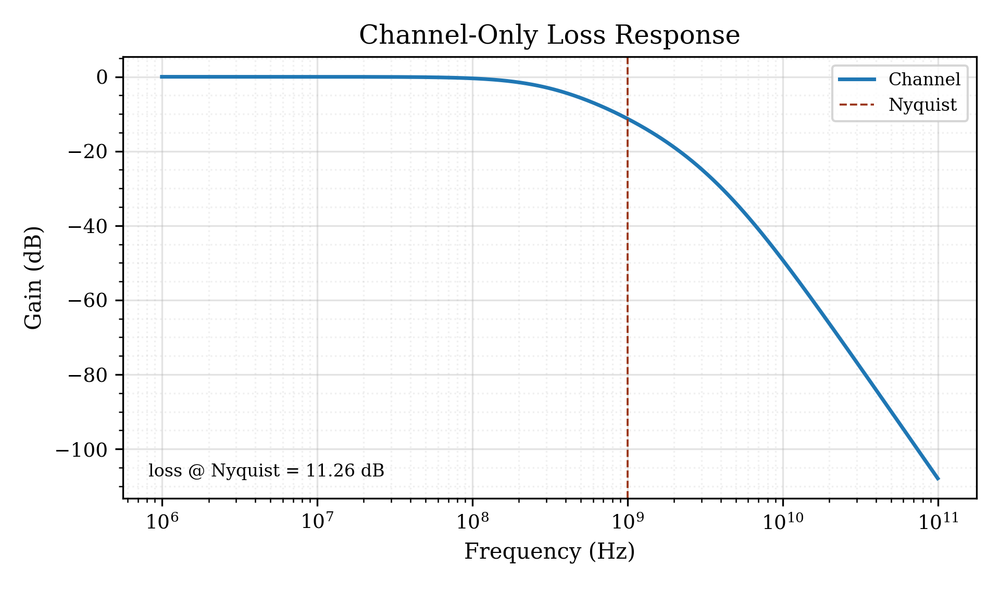
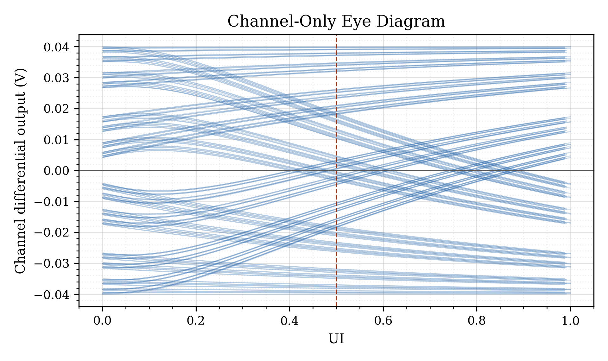
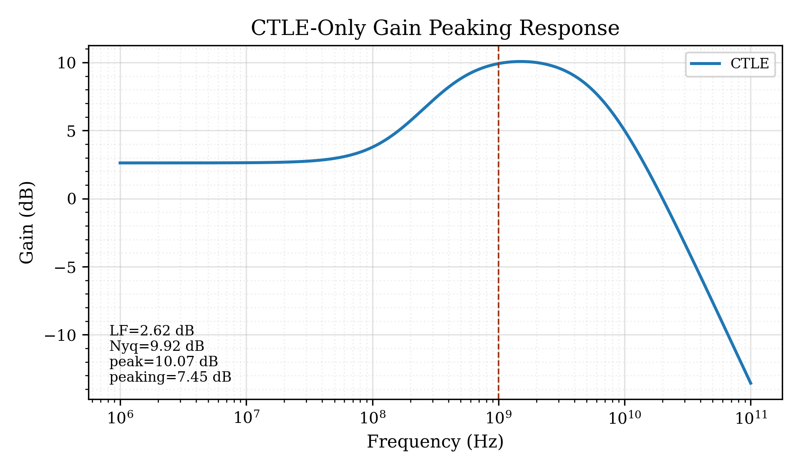
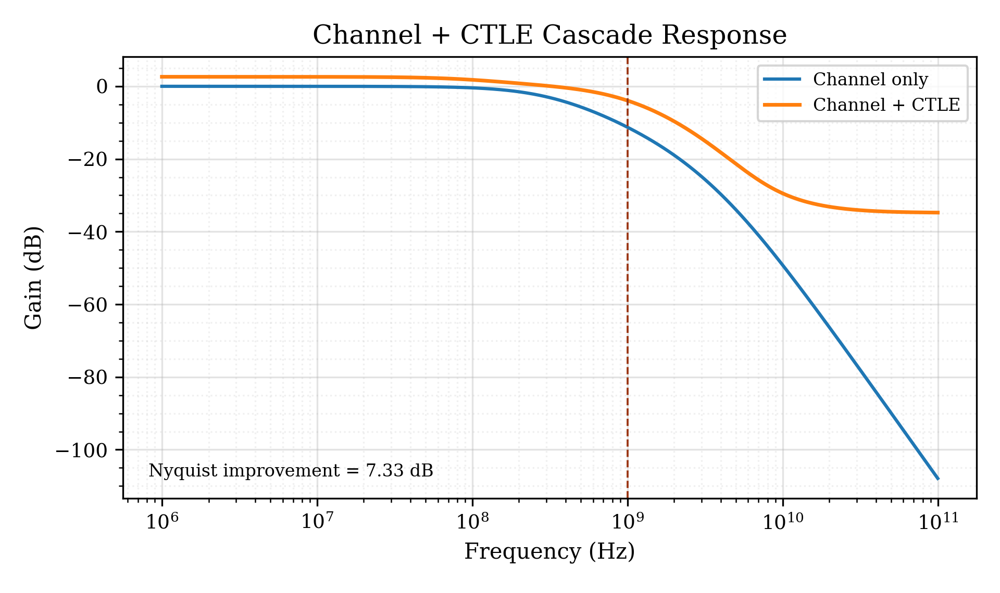
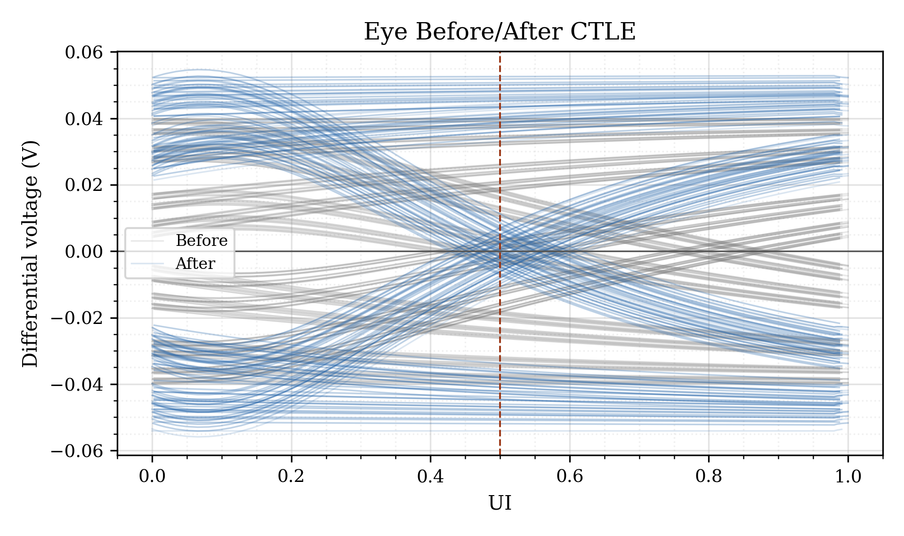
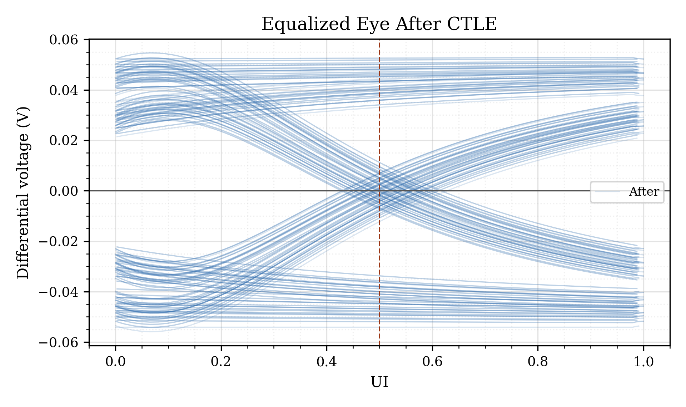
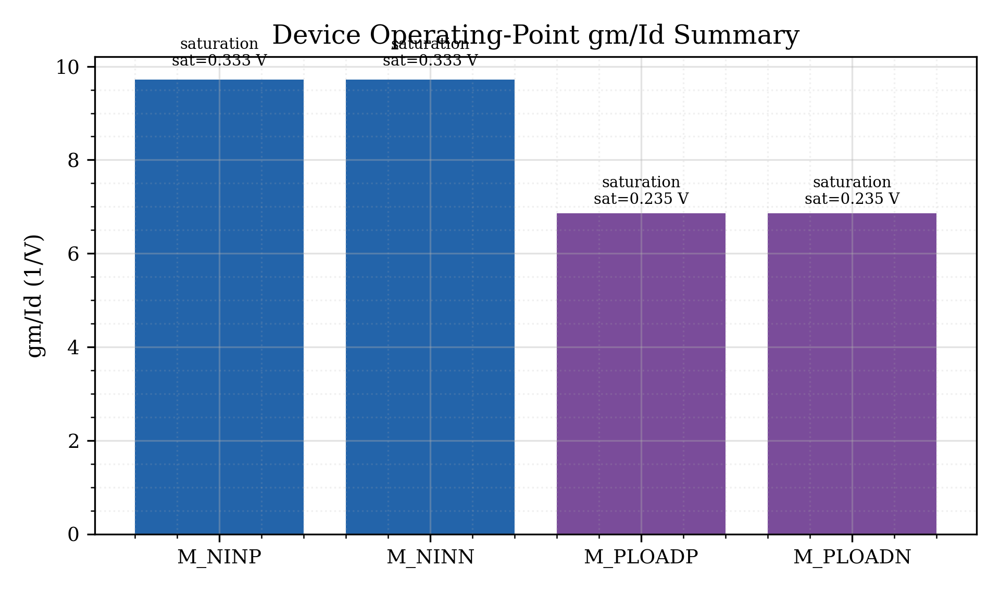
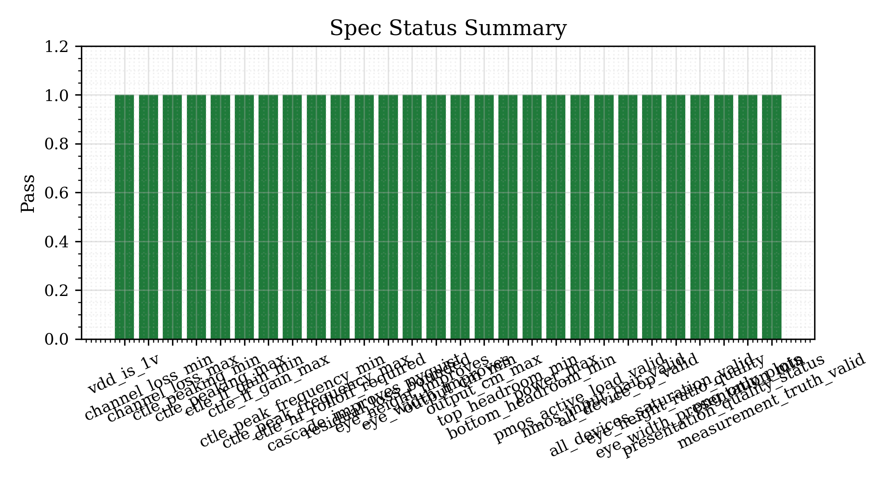

# Skynet Analog Agent

Skynet Analog Agent is the core **physics-aware analog CAD methodology engine** in this portfolio. It demonstrates how a user-level analog or mixed-signal circuit requirement can be converted into topology-aware sizing, gm/Id LUT-backed device selection, real LTspice simulation, measurement extraction, truth-gated validation, closed-loop correction, and reusable validated topology evidence.

This project is public-safe and methodology-focused. It does not include proprietary PDKs, confidential client material, commercial IP, or restricted company data.

---

## Methodology Snapshot

```text
User Requirement
→ Topology Knowledge Pack
→ gm/Id + LUT-Based Device Selection
→ Testbench / Netlist Generation
→ Real Simulation
→ Measurement Extraction
→ Spec Truth Gate
→ Closed-Loop Correction
→ Final Evidence Package
→ Reusable Golden Topology
→ Topology Maturity Map
```

The key idea is simple: **the engine flow stays common, but the topology knowledge pack changes.**  
Each circuit type provides its own sizing rules, physics constraints, testbench plan, measurement contracts, report plots, and closed-loop correction strategy.

---

## What It Demonstrates

- Topology-aware analog design automation
- gm/Id and LUT-based NMOS/PMOS device selection
- SPICE/LTspice simulation evidence generation
- Measurement extraction from real simulator outputs
- Truth-gated specification evaluation
- Closed-loop correction when a design fails
- Reusable golden topology promotion
- Public-safe evidence packaging for GitHub, LinkedIn, professors, and recruiters

---

## Engine-Level Design Flow

The Skynet Analog Agent treats each analog design as a staged CAD task.

1. **Project Manifest** defines the user requirement, topology type, specs, and required analyses.
2. **Knowledge Pack** defines topology-specific device roles, sizing logic, testbench requirements, measurement rules, and plot requirements.
3. **gm/Id LUT Layer** provides device-physics memory for NMOS/PMOS sizing.
4. **Sizing Stages** derive gm, current, length, width/multiplicity, bias, region, headroom, and operating-point targets.
5. **Netlist Writer** generates LTspice-compatible testbenches.
6. **Simulation Runner** executes OP/DC/AC/transient simulations.
7. **Measurement Extractor** reads real simulator outputs and generates measurement JSON/CSV artifacts.
8. **Spec Evaluator** checks only real required measurements.
9. **Closed-Loop Engine** reruns valid LUT-backed candidates when specs fail.
10. **Final Report Stage** generates PNG plots, tables, summaries, and project evidence.
11. **Regression Guard** protects already validated topologies from future changes.

---

## Validated Topologies

| Topology | Purpose | Status |
| --- | --- | --- |
| [`00_inverter_3ghz_clock_buffer`](validated_topologies/00_inverter_3ghz_clock_buffer/) | High-speed unit-cell switching validation and timing/power evidence | `VALIDATED UNIT CELL` |
| [`01_common_source_amplifier`](validated_topologies/01_common_source_amplifier/) | gm/Id-based single-ended analog gain-cell validation | `VALIDATED / PASS` |
| [`02_differential_pair`](validated_topologies/02_differential_pair/) | Matched differential input stage with gain, common-mode, tail-current and balance checks | `VALIDATED / PASS` |
| [`03_two_stage_opamp`](validated_topologies/03_two_stage_opamp/) | Two-stage compensated op-amp with gain, UGB, phase margin, slew and settling checks | `VALIDATED / PASS` |
| [`04_ctle_nrz_2gbps`](validated_topologies/04_ctle_nrz_2gbps/) | 2 Gb/s NRZ CTLE receiver front-end with channel loss, peaking, PRBS, eye and headroom validation | `VALIDATED / PASS` |

---

## Latest Validated High-Speed Block: CTLE NRZ Equalizer at 2 Gb/s

The newest validated topology is a **2 Gb/s NRZ CTLE receiver front-end**. It extends the engine from low-frequency analog blocks into a high-speed serial-link equalization problem.

### CTLE Design Intent

The CTLE is designed as an **NMOS differential-pair equalizer with PMOS active loads**. The engine validates the design using:

- 1.0 V supply
- 2 Gb/s NRZ data rate
- 500 ps unit interval
- 1 GHz Nyquist target
- lossy channel fixture
- PMOS active-load CTLE topology
- gm/Id LUT-aware NMOS/PMOS selection
- PRBS transient validation
- eye-height and eye-width extraction
- output common-mode and rail-headroom checks
- power/current checks
- device saturation validation

### CTLE Validated Result Summary

| Metric | Result |
| --- | --- |
| Data rate | **2 Gb/s NRZ** |
| UI | **500 ps** |
| Nyquist frequency | **1 GHz** |
| Supply voltage | **1.0 V** |
| Channel loss at Nyquist | **~11.25 dB** |
| CTLE low-frequency gain | **~2.62 dB** |
| CTLE gain at Nyquist | **~9.92 dB** |
| CTLE peak gain | **~10.07 dB** |
| CTLE peaking | **~7.45 dB** |
| CTLE peak frequency | **~1.49 GHz** |
| Residual loss after CTLE at Nyquist | **~3.93 dB** |
| Cascade improvement at Nyquist | **~7.33 dB** |
| Eye height before CTLE | **~18.7 mV** |
| Eye height after CTLE | **~59.8 mV** |
| Eye-height improvement | **~3.2×** |
| Eye width before CTLE | **~0.18 UI** |
| Eye width after CTLE | **~1.0 UI** |
| Output common-mode | **~0.55 V** |
| Total power | **~35.6 µW** |
| Device operating region | **NMOS/PMOS valid in saturation** |

### CTLE Evidence Preview

| Plot | Plot |
| --- | --- |
| <br><sub>Channel-Only Loss Response</sub> | <br><sub>Channel-Only Eye Diagram</sub> |
| <br><sub>CTLE-Only Gain Peaking Response</sub> | <br><sub>Channel + CTLE Cascade Response</sub> |
| <br><sub>Eye Before/After CTLE</sub> | <br><sub>Equalized Eye After CTLE</sub> |
| <br><sub>Device Operating-Point gm/Id Summary</sub> | <br><sub>Spec Status Summary</sub> |

Open the full CTLE evidence package:

- [`validated_topologies/04_ctle_nrz_2gbps/`](validated_topologies/04_ctle_nrz_2gbps/)
- [`validated_topologies/04_ctle_nrz_2gbps/plots/`](validated_topologies/04_ctle_nrz_2gbps/plots/)
- [`validated_topologies/04_ctle_nrz_2gbps/reports/`](validated_topologies/04_ctle_nrz_2gbps/reports/)
- [`validated_topologies/04_ctle_nrz_2gbps/tables/`](validated_topologies/04_ctle_nrz_2gbps/tables/)
- [`validated_topologies/04_ctle_nrz_2gbps/notes/`](validated_topologies/04_ctle_nrz_2gbps/notes/)

---

## Folder Map

```text
projects/01_skynet_analog_agent/
├── README.md
├── validated_topologies/
│   ├── 00_inverter_3ghz_clock_buffer/
│   ├── 01_common_source_amplifier/
│   ├── 02_differential_pair/
│   ├── 03_two_stage_opamp/
│   └── 04_ctle_nrz_2gbps/
│       ├── README.md
│       ├── plots/
│       ├── reports/
│       ├── tables/
│       └── notes/
└── lut_gmid_database/
```

---

## Failure-Aware CAD Behavior

The engine does not silently print `PASS`.

When a design fails, it reports the responsible stage and reason, such as:

- no valid LUT candidate
- invalid PMOS/NMOS operating region
- missing netlist
- missing simulation RAW file
- failed gain / bandwidth / power / headroom / phase / eye-opening target
- stale or synthetic measurement source
- exhausted physics-valid candidate space

This is intentional. The framework behaves like a verification-driven CAD flow, not a simple plotting script.

---

## Closed-Loop Correction

When a design misses target specs, the engine can adjust:

- gm/Id target
- device length
- device width / multiplicity
- bias current
- active-load candidate
- compensation value
- CTLE RS/CS zero-pole tuning
- output bias / headroom targets
- topology-specific design parameters

Then it reruns the real simulation chain:

```text
Netlist Generation
→ LTspice Simulation
→ Measurement Extraction
→ Spec Evaluation
→ Final Truth Gate
```

The loop stops only when all required specs pass with real measurements or the valid physics/LUT candidate space is exhausted.

---

## Public-Safe Disclosure

This folder is a public-safe portfolio artifact. It is intended to demonstrate methodology, engineering reasoning, and software architecture. It does not include proprietary PDK files, foundry decks, confidential customer data, commercial IP, private company reports, or restricted design material.
