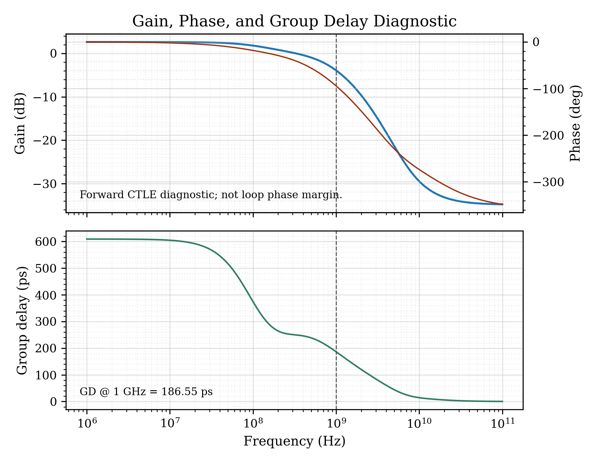
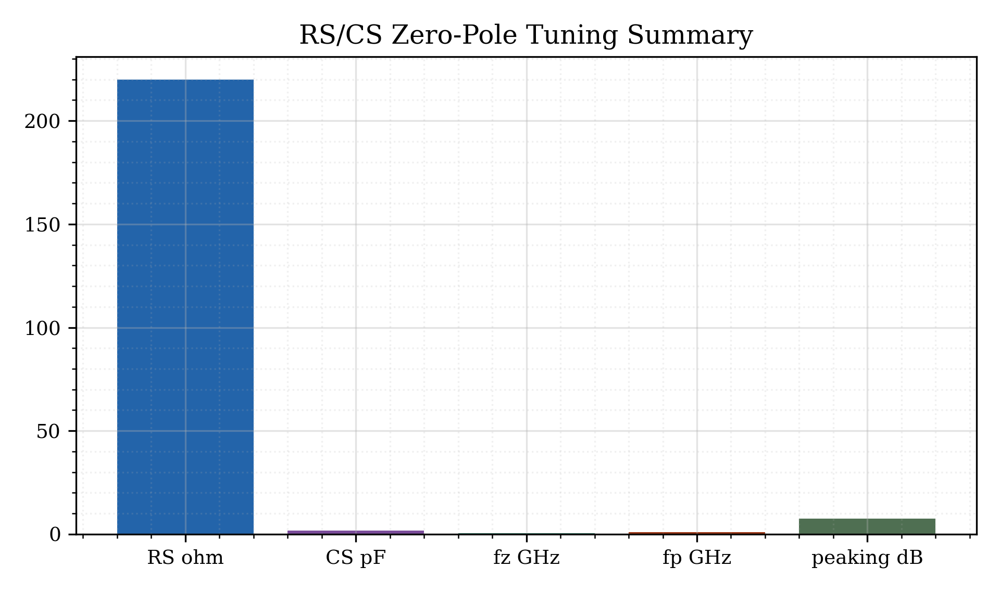
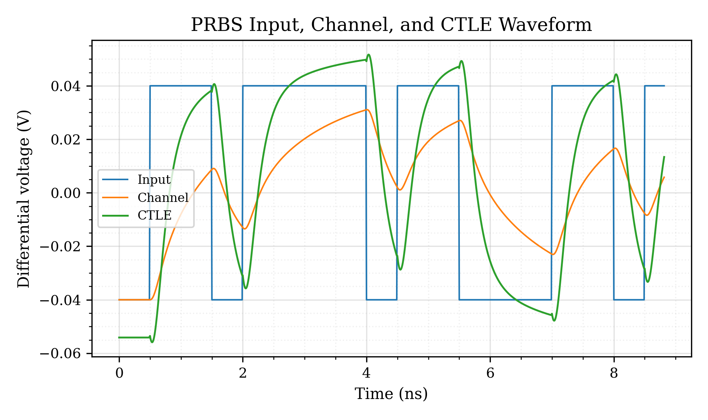
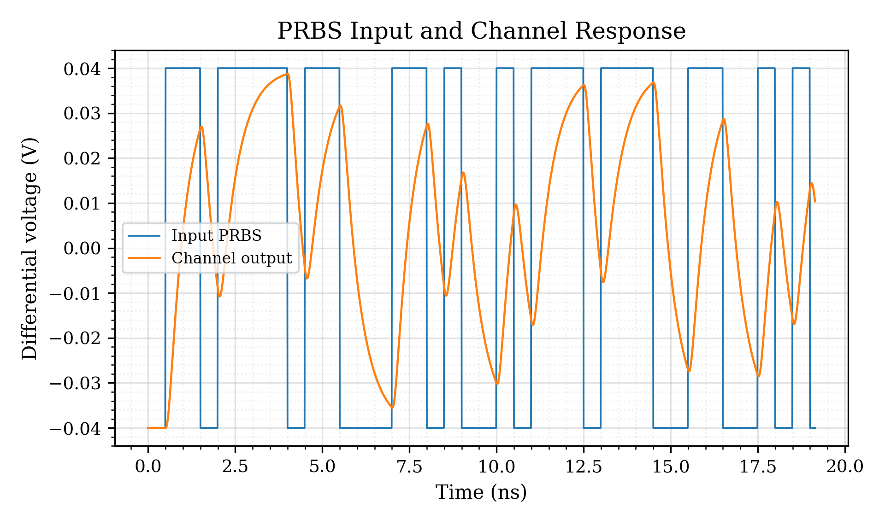
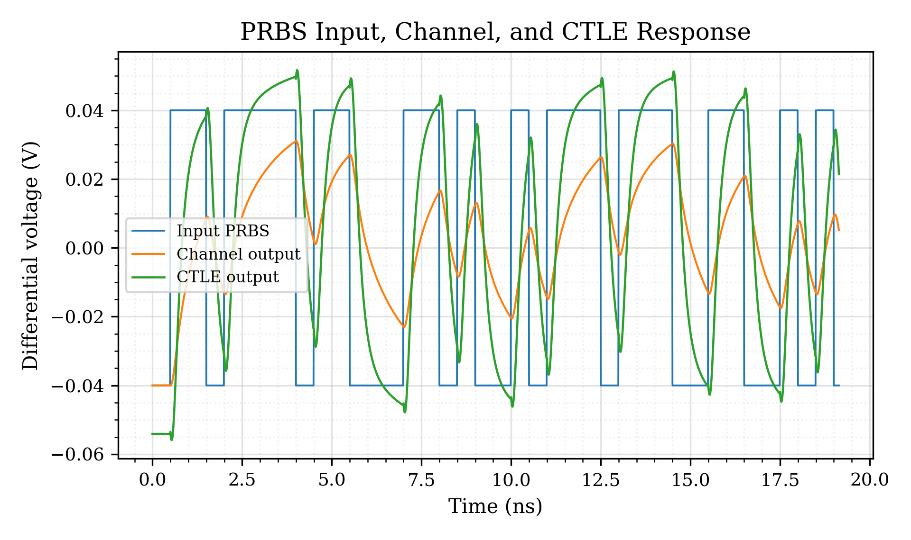
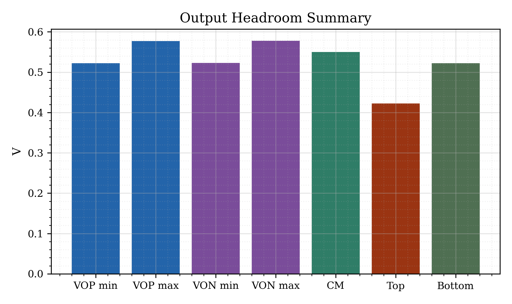
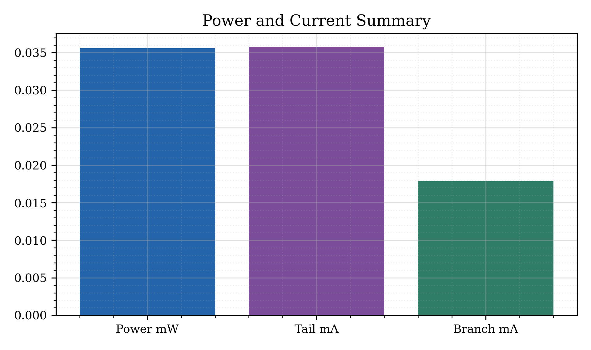

# CTLE Equalizer 2 Gb/s NRZ Receiver Front-End

## Validated High-Speed Analog Topology — Skynet Analog Agent

This project demonstrates a **physics-aware, gm/Id LUT-driven CTLE equalizer design flow** for a **2 Gb/s NRZ serial-link receiver front-end** using a **1.0 V supply**. The design is built as an **NMOS differential-pair CTLE with PMOS active loads**, source-degeneration zero/pole tuning, a lossy-channel fixture, PRBS transient validation, eye-diagram extraction, headroom checks, power/current checks, and device operating-region validation.

This is a public, non-confidential methodology demonstration. It does not include proprietary PDK files, client data, foundry collateral, commercial IP, or confidential company material.

---

## 3-Minute Reviewer Path

1. Check the **target link specification**: 2 Gb/s NRZ, 500 ps UI, 1 GHz Nyquist.
2. Review the **channel-only loss** and **channel-only eye** plots to see the degraded link before equalization.
3. Review the **CTLE gain peaking** plot to see the zero/pole tuning and high-frequency roll-off.
4. Review the **channel + CTLE cascade response** to see how the CTLE compensates Nyquist loss.
5. Review the **PRBS waveform** and **eye before/after CTLE** plots to see time-domain improvement.
6. Review the **output headroom**, **gm/Id operating-point**, **RS/CS tuning**, and **power/current** summaries.
7. Check the **spec status summary** to confirm the final validation gates.

---

## Design Flow Used by the Engine

```text
2 Gb/s NRZ user requirement
→ 500 ps UI and 1 GHz Nyquist target
→ lossy channel fixture generation
→ CTLE topology knowledge pack
→ gm/Id LUT-aware NMOS/PMOS candidate selection
→ PMOS active-load CTLE netlist generation
→ OP / AC / transient simulation
→ PRBS waveform extraction
→ eye-height and eye-width measurement
→ headroom, power, saturation, and truth-gate checks
→ final plots, reports, and reusable topology evidence
```

The important point is that this is not only a plot-generation exercise. The engine uses topology knowledge, gm/Id LUT data, operating-point filtering, simulation truth gates, and final report validation to decide whether the CTLE design is acceptable.

---

## Circuit Intent

The CTLE is intended to compensate a lossy high-speed channel around the Nyquist frequency.

The design uses:

- **NMOS differential input pair** for the high-speed input stage
- **PMOS active loads** instead of simple resistor loads
- **source-degeneration RS/CS network** for zero/pole shaping
- **1.0 V supply** for short-channel analog operation
- **channel fixture** to model Nyquist loss before equalization
- **PRBS stimulus** to validate time-domain behavior
- **eye-diagram measurement** to quantify equalization improvement
- **OP checks** to verify NMOS/PMOS saturation and headroom validity

---

## User-Level Specification

| Parameter | Target / Requirement |
| --- | --- |
| Data format | NRZ |
| Data rate | 2 Gb/s |
| Unit interval | 500 ps |
| Nyquist frequency | 1 GHz |
| Supply voltage | 1.0 V |
| Channel loss at Nyquist | Approximately 8 dB to 12 dB |
| CTLE peaking | Approximately 5 dB to 8 dB |
| Low-frequency CTLE gain | Bounded, not artificially high |
| High-frequency CTLE behavior | Peaking near Nyquist followed by realistic roll-off |
| Load style | PMOS active load |
| Transient validation | PRBS input, channel output, and CTLE output |
| Eye validation | Eye-height and eye-width improvement required |
| Circuit validation | Output common-mode, top/bottom headroom, power, current, and saturation checks |
| Measurement source | Real simulation and generated report artifacts |

---

## Validated Result Summary

| Metric | Measured Result | Status |
| --- | ---: | --- |
| Channel loss at Nyquist | 11.25 dB | PASS |
| CTLE low-frequency gain | 2.62 dB | PASS |
| CTLE gain at Nyquist | 9.92 dB | PASS |
| CTLE peak gain | 10.07 dB | PASS |
| CTLE peaking | 7.45 dB | PASS |
| CTLE peak frequency | 1.50 GHz | PASS |
| CTLE high-frequency roll-off from peak | 23.63 dB | PASS |
| Channel + CTLE residual loss at Nyquist | 3.93 dB | PASS |
| Cascade improvement at Nyquist | 7.33 dB | PASS |
| Eye height before CTLE | 18.7 mV | Reference |
| Eye height after CTLE | 59.8 mV | PASS |
| Eye-height improvement | 3.2× | PASS |
| Eye width before CTLE | 0.18 UI | Reference |
| Eye width after CTLE | 1.0 UI | PASS |
| Output common-mode | 0.55 V | PASS |
| Top headroom | 0.42 V | PASS |
| Bottom headroom | 0.52 V | PASS |
| Total power | 35.6 µW | PASS |
| NMOS input-pair operating region | Saturation valid | PASS |
| PMOS active-load operating region | Saturation valid | PASS |
| Final presentation-quality status | Clean evidence package | PASS |

---

## Final CTLE Tuning Summary

| Parameter | Final Value |
| --- | ---: |
| `RS` | 220 Ω |
| `CS` | 1.8 pF |
| Zero frequency | 402 MHz |
| First pole frequency | 844 MHz |
| Second pole frequency | 8.0 GHz |
| CTLE peak frequency | 1.50 GHz |
| CTLE peaking | 7.45 dB |

The zero/pole placement gives useful high-frequency emphasis around the 1 GHz Nyquist region while still showing realistic high-frequency roll-off. This avoids the unrealistic behavior where CTLE gain keeps saturating flat up to very high frequency.

---

## Evidence Plot Gallery

All images below use **relative paths from this CTLE project root**, so they load correctly when this README is placed at:

```text
projects/01_skynet_analog_agent/validated_topologies/04_ctle_nrz_2gbps/README.md
```

### Frequency-Domain and Channel Evidence

| Plot | Plot |
| --- | --- |
| <br><sub>01 Channel-only loss response</sub> | <br><sub>02 Channel-only eye diagram</sub> |
| <br><sub>03 CTLE-only gain peaking response</sub> | <br><sub>04 Channel + CTLE cascade response</sub> |
| <br><sub>05 Gain, phase, and group-delay diagnostic</sub> | <br><sub>11 RS/CS zero-pole tuning summary</sub> |

### PRBS and Eye-Diagram Evidence

| Plot | Plot |
| --- | --- |
| <br><sub>06 PRBS input, channel, and CTLE waveform</sub> | <br><sub>06a PRBS input and channel response</sub> |
| <br><sub>06b PRBS input, channel, and CTLE response</sub> | <br><sub>07 Eye before/after CTLE</sub> |
| <br><sub>08 Equalized eye after CTLE</sub> |  |

### Circuit Operating-Point and Final Validation Evidence

| Plot | Plot |
| --- | --- |
| <br><sub>09 Output headroom summary</sub> | <br><sub>10 Device operating-point gm/Id summary</sub> |
| <br><sub>12 Power and current summary</sub> | <br><sub>13 Spec status summary</sub> |

---

## How to Read the Key Plots

### 1. Channel-Only Loss Response

The channel-only plot shows the insertion-loss style degradation before equalization. At the 1 GHz Nyquist marker, the channel loss is around **11.25 dB**, which is inside the intended degraded-channel range.

### 2. CTLE-Only Gain Peaking Response

The CTLE-only response shows the equalizer gain rising from a bounded low-frequency gain to a peak around **1.50 GHz**. The peak gain is around **10.07 dB**, with approximately **7.45 dB** peaking. The high-frequency roll-off confirms that the response is not an unrealistic flat boost at very high frequency.

### 3. Channel + CTLE Cascade Response

The cascade response compares the channel alone against the channel plus CTLE. Around Nyquist, the CTLE improves the channel response by about **7.33 dB**, reducing the residual Nyquist loss to about **3.93 dB**.

### 4. PRBS Waveform and Eye Diagrams

The PRBS plots show the input bit pattern, the degraded channel waveform, and the equalized CTLE output. The eye plots quantify this improvement:

```text
Eye height before CTLE  ≈ 18.7 mV
Eye height after CTLE   ≈ 59.8 mV
Eye-height improvement  ≈ 3.2×
Eye width before CTLE   ≈ 0.18 UI
Eye width after CTLE    ≈ 1.0 UI
```

This directly shows that the equalizer improves both vertical and horizontal eye opening.

### 5. Headroom and Operating-Point Checks

The output headroom plot verifies the common-mode and top/bottom voltage margins. The gm/Id operating-point plot verifies that the selected NMOS and PMOS devices are operating in valid saturation regions rather than invalid triode/cutoff points.

---

## Why This Project Matters

This CTLE project extends the Skynet Analog Agent from basic analog building blocks into a high-speed serial-link receiver front-end problem.

It demonstrates that the same automation philosophy can handle:

- topology-aware analog design
- gm/Id LUT-based device selection
- PMOS active-load validation
- lossy-channel modeling
- zero/pole tuning
- CTLE gain peaking and roll-off validation
- PRBS transient response
- eye-height and eye-width measurement
- output common-mode and headroom validation
- power/current checks
- device saturation checks
- final plot/report generation

The result is a reusable CTLE methodology block that can be extended later toward SerDes receiver front-end design, equalization studies, channel-aware analog design, and mixed-signal link-analysis automation.

---

## Project Folder Map

```text
04_ctle_nrz_2gbps/
├── README.md
├── plots/
│   ├── 01_channel_only_loss_response.png
│   ├── 02_channel_only_eye_diagram.png
│   ├── 03_ctle_only_gain_peaking_response.png
│   ├── 04_channel_ctle_cascade_response.png
│   ├── 05_gain_phase_group_delay_diagnostic.png
│   ├── 06_prbs_input_channel_ctle_waveform.png
│   ├── 06a_prbs_input_channel_response.png
│   ├── 06b_prbs_input_channel_ctle_response.png
│   ├── 07_eye_before_after_comparison.png
│   ├── 08_eye_after_ctle.png
│   ├── 09_output_headroom_summary.png
│   ├── 10_device_operating_point_gmid_summary.png
│   ├── 11_rs_cs_zero_pole_tuning_summary.png
│   ├── 12_power_current_summary.png
│   └── 13_spec_status_summary.png
├── reports/
├── notes/
├── screenshots/
└── metadata/
```

---

## Public Disclosure

This project is a public-safe portfolio artifact. It is intended to demonstrate analog/mixed-signal design methodology, CAD-style automation thinking, and simulation-backed evidence generation.

It does not disclose proprietary PDKs, confidential foundry files, client design data, commercial IP, internal company documents, or restricted technology collateral.

---

## Status

```text
Topology: CTLE Equalizer 2 Gb/s NRZ Receiver Front-End
Engine: Skynet Analog Agent
Method: gm/Id LUT + topology knowledge pack + simulation truth gates
Supply: 1.0 V
Validation: PASS
Presentation-quality status: PASS
```
