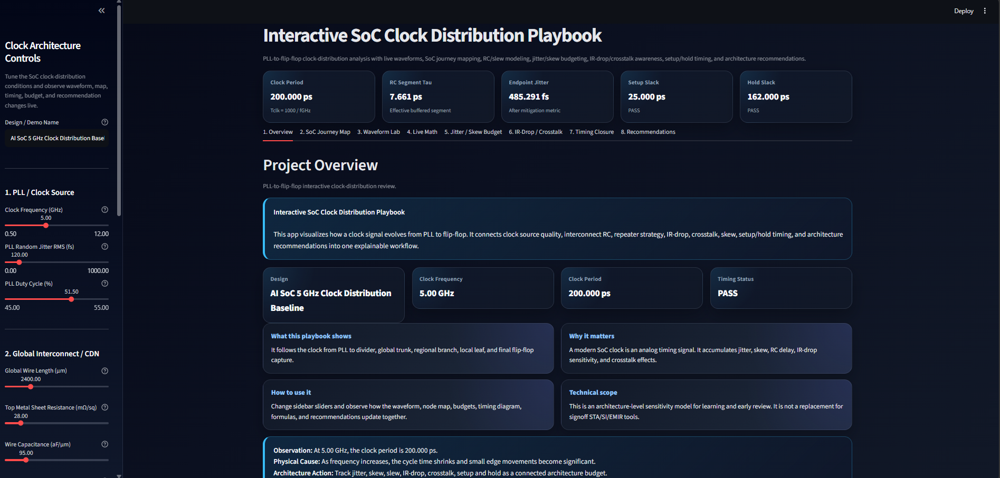
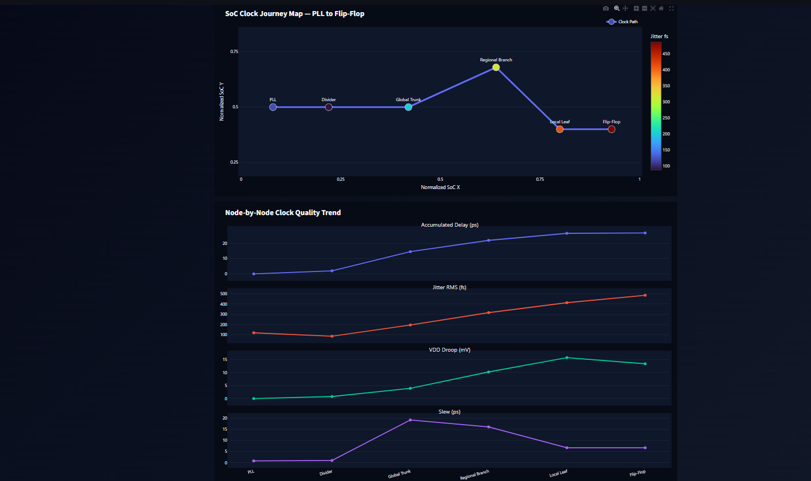
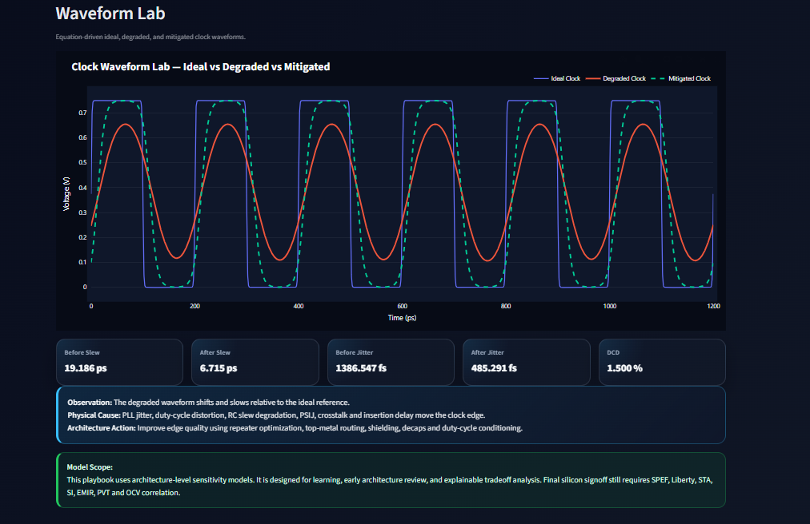
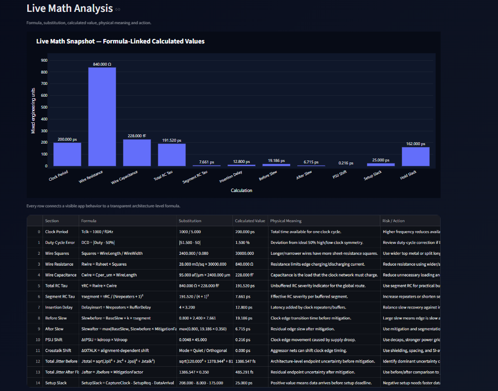
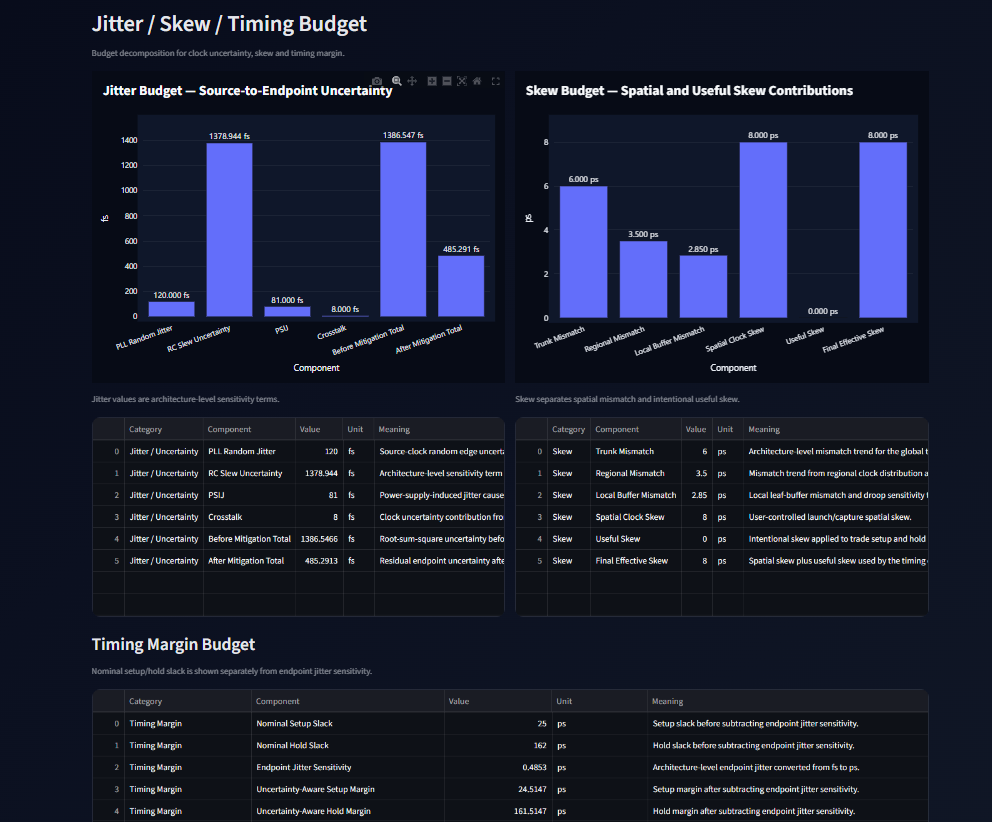
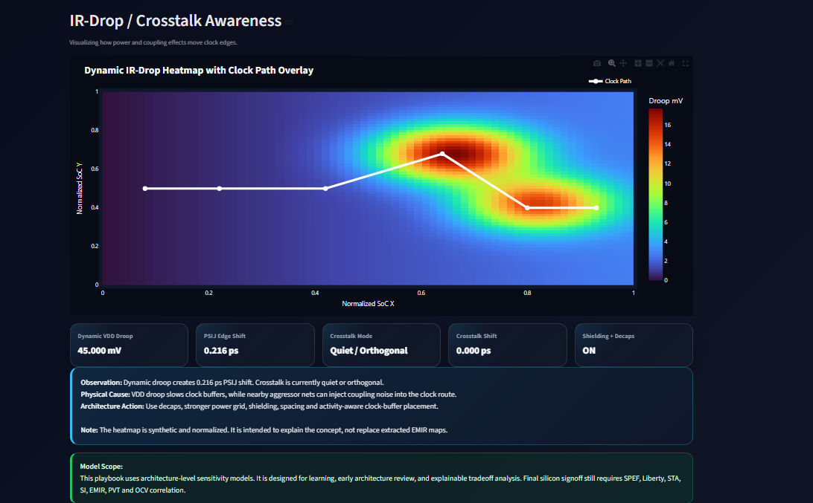
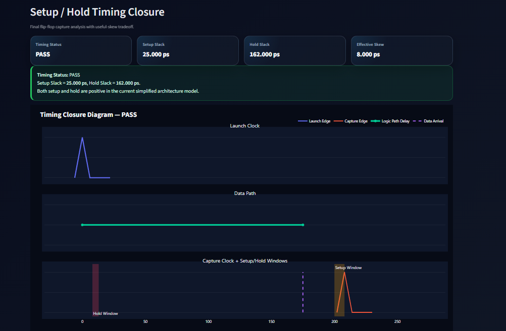
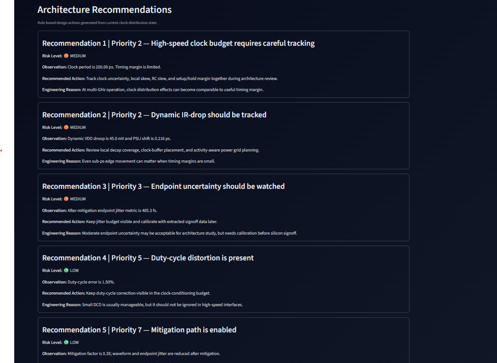

# Interactive SoC Clock Distribution Playbook

**A Python + Streamlit + Plotly interactive playbook for SoC clock distribution, PLL jitter, clock-tree RC delay, slew degradation, IR-drop, crosstalk, skew, setup/hold timing, and architecture-level clock analysis.**

This project visualizes how a clock signal travels from the **PLL** to the final **flip-flop capture point** inside a modern SoC clock distribution network.

The objective is **complexity reduction**: to make clock degradation, jitter accumulation, skew movement, IR-drop sensitivity, crosstalk effects, and setup/hold timing closure easier to understand using live waveforms, formulas, timing diagrams, SoC path visualization, and architecture recommendations.

---

## Table of Contents

1. [Project Overview](#1-project-overview)
2. [Why This Project Matters](#2-why-this-project-matters)
3. [Clock Journey Explained](#3-clock-journey-explained)
4. [Key Features](#4-key-features)
5. [Screenshots](#5-screenshots)
6. [Application Tabs](#6-application-tabs)
7. [Default 5 GHz AI SoC Demo Scenario](#7-default-5-ghz-ai-soc-demo-scenario)
8. [Baseline Calculation Reference](#8-baseline-calculation-reference)
9. [Mathematical Models Used](#9-mathematical-models-used)
10. [Installation](#10-installation)
11. [Run Locally](#11-run-locally)
12. [Project Structure](#12-project-structure)
13. [Internal Validation](#13-internal-validation)
14. [Technical Documentation](#14-technical-documentation)
15. [Technical Scope and Limitations](#15-technical-scope-and-limitations)
16. [Why This Is Useful Beyond a Spreadsheet](#16-why-this-is-useful-beyond-a-spreadsheet)
17. [Future Roadmap](#17-future-roadmap)
18. [Final Takeaway](#18-final-takeaway)

---

## 1. Project Overview

A clock signal inside a SoC is often drawn as a clean square wave. In real silicon, it behaves more like a fragile analog timing waveform.

This playbook follows the clock through its complete journey:

```text
PLL
↓
Divider / Clock Conditioning
↓
Global Clock Trunk
↓
Regional Clock Branch
↓
Local Clock Leaf
↓
Flip-Flop Capture
```

At each stage, the clock can degrade, shift, or accumulate uncertainty because of physical effects such as:

* PLL phase noise
* Duty-cycle distortion
* Interconnect resistance and capacitance
* Repeater insertion delay
* Slew degradation
* Dynamic IR-drop
* Power-supply-induced jitter
* Crosstalk coupling
* Spatial skew
* Useful skew
* Setup/hold timing constraints

The app converts this complex multi-domain problem into an interactive architecture-review dashboard.

---

## 2. Why This Project Matters

Traditional SoC clock analysis is often split across many reports and tools:

| View           | What It Shows                               |
| -------------- | ------------------------------------------- |
| STA reports    | Setup/hold timing and slack                 |
| CTS reports    | Clock tree structure, insertion delay, skew |
| SI reports     | Coupling and crosstalk impact               |
| EMIR reports   | IR-drop, EM risk, power-grid weakness       |
| Excel sheets   | Manual timing and jitter budgeting          |
| Waveform debug | Local signal behavior                       |

This project does not replace those tools. Instead, it provides a single explainable layer where users can change architecture parameters and immediately see how the clock waveform, SoC journey, timing budget, setup/hold margin, and architecture recommendations respond together.

The purpose is to help students, engineers, interviewers, professors, and reviewers understand how clock distribution behaves as a complete system.

---

## 3. Clock Journey Explained

The application demonstrates a complete clock-distribution learning and architecture-analysis flow:

```text
Clock Source Quality
↓
Interconnect RC Degradation
↓
Repeater / Buffer Tradeoff
↓
IR-Drop and Crosstalk Sensitivity
↓
Jitter / Skew Budgeting
↓
Setup / Hold Timing Closure
↓
Architecture Recommendation
```

### Target Users

* VLSI students learning clock distribution
* Digital design engineers studying timing closure
* STA and CTS engineers explaining clock risk
* Physical-design engineers reviewing clock-tree sensitivity
* SoC architects doing early clock-distribution tradeoff analysis
* Interview candidates preparing for system-level VLSI discussions
* Professors and reviewers evaluating silicon-design understanding

---

## 4. Key Features

### 4.1 Interactive Architecture Controls

The sidebar allows the user to control the full clock scenario.

| Category                  | User-Controlled Parameters                                                  |
| ------------------------- | --------------------------------------------------------------------------- |
| PLL / Clock Source        | Clock frequency, PLL random jitter, PLL duty cycle                          |
| Global Interconnect / CDN | Wire length, sheet resistance, capacitance, repeater count                  |
| Real Silicon Enemies      | Dynamic VDD droop, crosstalk alignment, shielding + decaps                  |
| Flip-Flop Timing          | Logic delay, spatial skew, useful skew, setup requirement, hold requirement |

Every slider updates the full dashboard live.

### 4.2 Live Waveform Generation

The app generates mathematical waveforms programmatically:

* Ideal clock
* Degraded clock
* Mitigated clock

These waveforms are not static images. They change with the selected clock frequency, jitter, duty cycle, RC load, repeater count, droop, crosstalk, and mitigation settings.

### 4.3 Live Math Analysis

Every major number is connected to:

* Formula
* Input substitution
* Calculated value
* Physical meaning
* Risk or action

This makes the app explainable rather than a black box.

### 4.4 Timing Closure Visualization

The timing tab shows:

* Launch clock
* Data path
* Capture clock
* Setup window
* Hold window
* Setup slack
* Hold slack
* Timing status

It demonstrates how useful skew can improve setup timing but may create hold risk.

### 4.5 Architecture Recommendations

The recommendation engine converts live parameter values into design actions such as:

* Improve repeater strategy
* Review duty-cycle correction
* Add shielding and spacing
* Strengthen decaps and power grid
* Use useful skew carefully
* Add hold buffers when hold margin is at risk

---

## 5. Screenshots

The screenshots below are rendered from the interactive Streamlit application.

### 5.1 Project Overview



### 5.2 SoC Clock Journey Map



### 5.3 Waveform Lab



### 5.4 Live Math Analysis



### 5.5 Jitter / Skew Budget



### 5.6 IR-Drop / Crosstalk Awareness



### 5.7 Timing Closure



### 5.8 Architecture Recommendations



---

## 6. Application Tabs

The Streamlit app is organized into eight technical tabs.

| Tab                     | Purpose                                            |
| ----------------------- | -------------------------------------------------- |
| 1. Overview             | High-level project summary and live health metrics |
| 2. SoC Journey Map      | PLL-to-flip-flop clock-quality evolution           |
| 3. Waveform Lab         | Ideal, degraded, and mitigated clock waveforms     |
| 4. Live Math            | Formula-by-formula calculation transparency        |
| 5. Jitter / Skew Budget | Clock uncertainty and skew decomposition           |
| 6. IR-Drop / Crosstalk  | Power-noise and coupling awareness                 |
| 7. Timing Closure       | Setup/hold timing diagram and slack calculation    |
| 8. Recommendations      | Rule-based architecture actions                    |

### Tab 1 — Overview

This tab introduces the complete PLL-to-flip-flop clock-distribution problem.

The top metric strip gives immediate visibility into:

```text
Clock Period
RC Segment Tau
Endpoint Jitter
Setup Slack
Hold Slack
```

For the default 5 GHz demo case:

```text
Clock Period       = 200.000 ps
RC Segment Tau     = 7.661 ps
Endpoint Jitter    = 485.291 fs
Setup Slack        = 25.000 ps
Hold Slack         = 162.000 ps
```

### Tab 2 — SoC Journey Map

This tab shows a normalized clock journey:

```text
PLL → Divider → Global Trunk → Regional Branch → Local Leaf → Flip-Flop
```

Each node displays:

* Accumulated delay
* Jitter RMS
* Local skew
* VDD droop
* Slew

The node coordinates are normalized visualization coordinates, not physical DEF floorplan coordinates.

### Tab 3 — Waveform Lab

This tab compares:

```text
Ideal Clock
Degraded Clock
Mitigated Clock
```

The degraded clock includes:

* PLL random jitter
* Duty-cycle distortion
* RC slew degradation
* Repeater insertion delay
* PSIJ edge shift
* Crosstalk edge shift

The mitigated clock shows the architecture-level improvement from shielding, decaps, clock conditioning, better segmentation, and reduced noise sensitivity.

### Tab 4 — Live Math Analysis

This tab explains every major number with:

```text
Formula
Input substitution
Calculated value
Physical meaning
Risk / action
```

Example:

```text
Tclk = 1000 / fGHz
Tclk = 1000 / 5
Tclk = 200 ps
```

This makes waveform movement, budget changes, and timing results traceable.

### Tab 5 — Jitter / Skew Budget

The jitter budget tracks:

* PLL random jitter
* RC slew uncertainty
* PSIJ
* Crosstalk
* Total before mitigation
* Total after mitigation

The skew budget separates:

* Trunk mismatch
* Regional mismatch
* Local buffer mismatch
* Spatial clock skew
* Useful skew
* Final effective skew

This is important because skew is not always bad. Controlled useful skew can improve setup margin, but excessive useful skew may create hold risk.

### Tab 6 — IR-Drop / Crosstalk Awareness

This tab shows a normalized synthetic IR-drop heatmap with clock path overlay.

It explains how power integrity becomes timing integrity:

```text
High switching activity
↓
Dynamic VDD droop
↓
Clock-buffer delay shift
↓
Clock edge movement
↓
Timing uncertainty
```

The PSIJ edge-shift model is:

```text
ΔtPSIJ = kdroop × Vdroop
```

The crosstalk mode shows how aggressor alignment can shift clock edges:

```text
In-Phase Aggressor      → positive edge shift
Out-of-Phase Aggressor  → negative edge shift
Quiet / Orthogonal      → small residual coupling
```

### Tab 7 — Timing Closure

This tab connects waveform behavior to final flip-flop capture.

It visualizes:

```text
Launch Clock
Data Path
Capture Clock
Setup Window
Hold Window
```

Setup equation:

```text
SetupSlack = CaptureClock - SetupRequirement - DataArrival
```

Hold equation:

```text
HoldSlack = DataArrival - (EffectiveSkew + HoldRequirement)
```

The app demonstrates a real timing tradeoff:

* Positive useful skew can improve setup slack.
* The same useful skew can reduce hold margin on short paths.

### Tab 8 — Architecture Recommendations

This tab converts live calculations into architecture actions.

Example recommendations:

* Track clock uncertainty when frequency is high.
* Review duty-cycle correction if DCD is present.
* Improve repeater strategy when segment RC is high.
* Strengthen decaps and power grid when droop is active.
* Use shielding and spacing when crosstalk is active.
* Use useful skew carefully for setup recovery.
* Add hold buffers or reduce useful skew for hold risk.
* Preserve timing margin even when nominal timing passes.

---

## 7. Default 5 GHz AI SoC Demo Scenario

The default scenario is a 5 GHz AI SoC clock-distribution baseline.

### 7.1 Clock Source

| Parameter         |   Value |
| ----------------- | ------: |
| Clock Frequency   | 5.0 GHz |
| PLL Random Jitter |  120 fs |
| PLL Duty Cycle    |   51.5% |

### 7.2 Global Interconnect / Clock Distribution Network

| Parameter             |    Value |
| --------------------- | -------: |
| Global Wire Length    |  2400 µm |
| Wire Width Assumption |  0.08 µm |
| Sheet Resistance      | 28 mΩ/sq |
| Wire Capacitance      | 95 aF/µm |
| Repeater Count        |        4 |

### 7.3 Real Silicon Enemies

| Parameter          |              Value |
| ------------------ | -----------------: |
| Dynamic VDD Droop  |              45 mV |
| Crosstalk Mode     | Quiet / Orthogonal |
| Shielding + Decaps |                 ON |

### 7.4 Flip-Flop Timing

| Parameter          |  Value |
| ------------------ | -----: |
| Logic Path Delay   | 175 ps |
| Spatial Clock Skew |   8 ps |
| Useful Skew        |   0 ps |
| Setup Requirement  |   8 ps |
| Hold Requirement   |   5 ps |

---

## 8. Baseline Calculation Reference

### 8.1 Clock Period

```text
Tclk = 1000 / fGHz
Tclk = 1000 / 5
Tclk = 200 ps
```

### 8.2 Wire Squares

```text
Squares = Wire Length / Wire Width
Squares = 2400 / 0.08
Squares = 30000
```

### 8.3 Wire Resistance

```text
Rwire = Rsheet × Squares
Rwire = 0.028 × 30000
Rwire = 840 Ω
```

### 8.4 Wire Capacitance

```text
Cwire = Cper_um × Length
Cwire = 95 aF/µm × 2400 µm
Cwire = 228 fF
```

### 8.5 Total RC Tau

```text
τRC = Rwire × Cwire
τRC = 840 Ω × 228 fF
τRC = 191.52 ps
```

This is an architecture-level unbuffered RC severity indicator, not a final extracted clock delay.

### 8.6 Segment RC Tau

```text
Segments = RepeaterCount + 1
Segments = 4 + 1
Segments = 5

τsegment = τRC / Segments²
τsegment = 191.52 / 25
τsegment = 7.6608 ps
```

### 8.7 Repeater Insertion Delay

```text
Insertion Delay = RepeaterCount × BufferDelay
Insertion Delay = 4 × 3.2
Insertion Delay = 12.8 ps
```

### 8.8 Setup Slack

```text
CaptureClock = Period + SpatialSkew + UsefulSkew
CaptureClock = 200 + 8 + 0
CaptureClock = 208 ps

SetupSlack = CaptureClock - SetupReq - DataArrival
SetupSlack = 208 - 8 - 175
SetupSlack = 25 ps
```

### 8.9 Hold Slack

```text
HoldSlack = DataArrival - (EffectiveSkew + HoldReq)
HoldSlack = 175 - (8 + 5)
HoldSlack = 162 ps
```

---

## 9. Mathematical Models Used

The current playbook uses transparent architecture-level models.

| Topic                 | Formula                                                       |
| --------------------- | ------------------------------------------------------------- |
| Clock Period          | `Tclk = 1000 / fGHz`                                          |
| Duty-Cycle Error      | `DCD = \|Duty - 50%\|`                                        |
| Wire Squares          | `Squares = WireLength / WireWidth`                            |
| Wire Resistance       | `Rwire = Rsheet × Squares`                                    |
| Wire Capacitance      | `Cwire = Cper_um × WireLength`                                |
| RC Time Constant      | `τRC = Rwire × Cwire`                                         |
| Repeater Segmentation | `τsegment = τRC / (Nrepeaters + 1)²`                          |
| Repeater Delay        | `Delayinsert = Nrepeaters × BufferDelay`                      |
| Slew Before Fix       | `Slewbefore = BaseSlew + k × τsegment`                        |
| Slew After Fix        | `Slewafter = max(BaseSlew, Slewbefore × MitigationFactor)`    |
| PSIJ Edge Shift       | `ΔtPSIJ = kdroop × Vdroop`                                    |
| Jitter Budget         | `Jtotal = sqrt(Jpll² + Jrc² + Jpsij² + Jxtalk²)`              |
| Setup Slack           | `SetupSlack = CaptureClock - SetupRequirement - DataArrival`  |
| Hold Slack            | `HoldSlack = DataArrival - (EffectiveSkew + HoldRequirement)` |

---

## 10. Installation

### 10.1 Requirements

* Python 3.10 or newer
* Windows, Linux, or macOS
* Recommended: Python virtual environment

### 10.2 Python Libraries

The project uses:

```text
streamlit
plotly
numpy
pandas
scipy
networkx
pydantic
rich
```

Install dependencies:

```bat
pip install -r requirements.txt
```

---

## 11. Run Locally

### 11.1 One-Click Windows Runner

From the project folder:

```bat
run_playbook.bat
```

### 11.2 Manual Windows Run

```bat
cd /d "<repo-folder>\projects\02_interactive_soc_clock_playbook"
python -m venv .venv
.venv\Scripts\activate
python -m pip install --upgrade pip
pip install -r requirements.txt
streamlit run app.py
```

### 11.3 Linux / macOS Run

```bash
cd <repo-folder>/projects/02_interactive_soc_clock_playbook
python3 -m venv .venv
source .venv/bin/activate
python -m pip install --upgrade pip
pip install -r requirements.txt
streamlit run app.py
```

---

## 12. Project Structure

```text
02_interactive_soc_clock_playbook/
├── app.py
├── requirements.txt
├── run_playbook.bat
├── run_full_validation.bat
├── README.md
├── .gitignore
│
├── core/
│   ├── __init__.py
│   ├── models.py
│   ├── clock_math.py
│   ├── waveform_engine.py
│   ├── soc_path_engine.py
│   ├── timing_engine.py
│   ├── recommendation_engine.py
│   └── validation_cases.py
│
├── ui/
│   ├── __init__.py
│   ├── styles.py
│   ├── cards.py
│   ├── plots.py
│   ├── sidebar.py
│   └── tabs.py
│
├── docs/
│   ├── 01_pll_to_flipflop_roadmap.md
│   ├── 02_clock_slew_load_delay.md
│   ├── 03_skew_jitter_uncertainty.md
│   ├── 04_setup_hold_margin.md
│   ├── 05_clock_power_emir_awareness.md
│   └── demo_script.md
│
├── examples/
│   └── ai_soc_5ghz_baseline.json
│
├── screenshots/
│   ├── overview.png
│   ├── soc_journey_map.png
│   ├── waveform_lab.png
│   ├── live_math.png
│   ├── jitter_skew_budget.png
│   ├── ir_drop_crosstalk.png
│   ├── timing_closure.png
│   └── recommendations.png
│
└── tools/
    └── final_project_audit.py
```

---

## 13. Internal Validation

The project includes internal validation cases.

Run:

```bat
python -m core.validation_cases
```

or use the full validation runner:

```bat
run_full_validation.bat
```

The validation checks:

* Baseline 5 GHz core math
* Long-wire RC stress
* Repeater tradeoff
* IR-drop and crosstalk stress
* Baseline setup/hold timing
* Setup violation and useful-skew recovery
* Hold violation case
* Waveform vector sanity
* Recommendation engine smoke test

Expected result:

```text
All validation cases passed: 9/9
```

This confirms internal model consistency.

---

## 14. Technical Documentation

Detailed notes are available in the `docs/` folder.

| Document                                                                    | Description                                                 |
| --------------------------------------------------------------------------- | ----------------------------------------------------------- |
| [`01_pll_to_flipflop_roadmap.md`](docs/01_pll_to_flipflop_roadmap.md)       | Complete PLL-to-flip-flop clock journey                     |
| [`02_clock_slew_load_delay.md`](docs/02_clock_slew_load_delay.md)           | Clock slew, load, delay, RC, and repeater tradeoff          |
| [`03_skew_jitter_uncertainty.md`](docs/03_skew_jitter_uncertainty.md)       | Jitter, skew, uncertainty, useful skew                      |
| [`04_setup_hold_margin.md`](docs/04_setup_hold_margin.md)                   | Setup/hold timing, slack, and useful-skew risk              |
| [`05_clock_power_emir_awareness.md`](docs/05_clock_power_emir_awareness.md) | Clock power, IR-drop, EMIR, crosstalk, decaps               |
| [`demo_script.md`](docs/demo_script.md)                                     | Demo walkthrough for GitHub, LinkedIn, and technical review |

---

## 15. Technical Scope and Limitations

This project is an **architecture-level educational and sensitivity-analysis playbook**.

It is not a replacement for production signoff tools.

Final silicon signoff still requires:

* SPEF extraction
* Liberty timing models
* Static timing analysis
* Signal-integrity analysis
* EMIR analysis
* PVT corner analysis
* OCV / AOCV / POCV analysis
* CTS implementation data
* Real floorplan and placement data

The current models are intentionally transparent and explainable. They are useful for:

* Learning
* Early architecture review
* Sensitivity analysis
* Demo explanation
* System-level discussion

They are not intended to claim foundry-accurate signoff numbers.

---

## 16. Why This Is Useful Beyond a Spreadsheet

Spreadsheets are useful for tabular budgeting, but clock distribution is a multi-domain problem.

Clock distribution includes:

* Waveform shape
* RC delay
* Slew degradation
* Jitter accumulation
* Skew movement
* IR-drop sensitivity
* Crosstalk shift
* Setup/hold closure
* Architecture mitigation

This playbook complements spreadsheet-based analysis by connecting the full reasoning chain:

```text
Slider input
↓
Formula
↓
Calculated value
↓
Waveform behavior
↓
SoC map
↓
Budget table
↓
Timing diagram
↓
Architecture recommendation
```

This makes the clock-distribution problem easier to communicate across architecture, timing, CTS, SI, EMIR, and design teams.

---

## 17. Future Roadmap

Planned future extensions:

* Import real SPEF parasitics.
* Import Liberty timing tables.
* Import STA timing reports.
* Import EMIR droop maps.
* Add DEF/floorplan-based clock path coordinates.
* Add real clock-tree graph visualization.
* Add frequency sweep and margin sweep.
* Add PVT corner comparison.
* Add CSV export for budgets and recommendations.
* Add SerDes / HBM clocking case studies.
* Add optimization mode for repeater count, wire length, and skew strategy.

---

## 18. Final Takeaway

A modern SoC clock is not merely a square wave.

It is a fragile analog timing signal moving through:

```text
PLL noise
Duty-cycle distortion
RC interconnect
Clock buffers
Dynamic IR-drop
Crosstalk aggressors
Spatial skew
Useful skew
Setup/hold timing windows
```

This playbook makes that journey visible, measurable, and explainable.

It helps users understand not only what is failing, but why it is failing and which architecture knob can improve it.

---

## SEO Keywords

```text
SoC clock distribution, VLSI timing analysis, clock tree synthesis, CTS, STA,
PLL jitter, clock skew, useful skew, setup hold timing, IR drop, EMIR,
crosstalk, clock uncertainty, clock slew, semiconductor design automation,
Streamlit VLSI dashboard, Plotly waveform analysis, Python EDA tool
```
